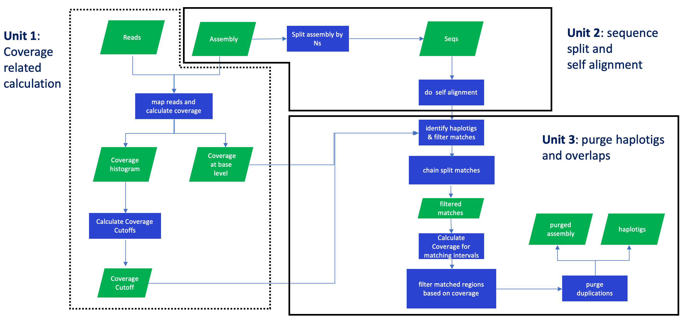
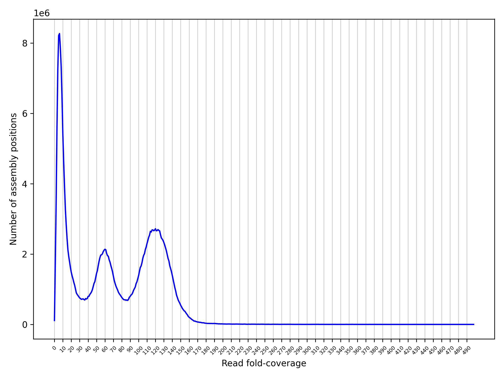

# Purge_Dups 

purge haplotigs and overlaps in an assembly based on read depth

## Directory Structure

- scripts/pd\_config.py: script to generate a configuration file used by run\_purge\_dups.py.
- scripts/run\_purge\_dups.py: script to run the purge\_dups pipeline. 
- scripts/run\_busco:  script to run busco, dependency: busco.
- scripts/run\_kcm:  script to make k-mer comparison plot. 
- scripts/sub.sh: shell script to submit a farm job.
- src: purge_dups source files.
- src/split_fa: split fasta file by 'N's.
- src/pbcstat: create read depth histogram and base-level read depth for an assembly based on pacbio data.
- src/ngstat: create read depth histogram and base-level read detph for an assembly based on illumina data.
- src/calcuts: calculate coverage cutoffs.
- src/purge_dups: purge haplotigs and overlaps for an assembly.
- src/get_seqs: obtain seqeuences after purging. 
- bin/\* : all purge_dups excutables.

## Overview

purge\_dups is designed to remove haplotigs and contig overlaps in a *de novo* assembly based on read depth. 

You can follow the [Usage](#usg) part and use our pipeline to purge your assembly or go to the [Pipeline Guide](#pplg) to build your own pipeline.




## Dependencies

1. zlib
2. minimap2 
3. runner (optional)
4. python3 (optional)


## Installation
Run the following commands to intall purge_dups (required):

```
git clone https://github.com/dfguan/purge_dups.git
cd purge_dups/src && make

```
Run the following commands to install runner (optional), this is only needed when you want to run scripts/run_purge_dups.py:

```
git clone https://github.com/dfguan/runner.git
cd runner && python3 setup.py install --user
```
If you also want to try k-mer comparision plot, run the following commands to install the tool (optional). 

```
git clone https://github.com/dfguan/KMC.git 
cd KMC && make -j 16
```
## <a name="usg"> </a> Usage (Only tested on farm)

### Step 1. Use pd\_config.py to generate a configuration file. 

```
usage: pd_config.py [-h] [-s SRF] [-l LOCD] [-n FN] [--version] ref pbfofn

generate a configuration file in json format

positional arguments:
  ref                   reference file in fasta/fasta.gz format
  pbfofn                list of pacbio file in fastq/fasta/fastq.gz/fasta.gz format (one absolute file path per line)

optional arguments:
  -h, --help            show this help message and exit
  -s SRF, --srfofn SRF  list of short reads files in fastq/fastq.gz format (one record per line, the
                        record is a tab splitted line of abosulte file path
                        plus trimmed bases, refer to
                        https://github.com/dfguan/KMC) [NONE]
  -l LOCD, --localdir LOCD
                        local directory to keep the reference and lists of the
                        pacbio, short reads files [.]
  -n FN, --name FN      output config file name [config.json]
  --version             show program's version number and exit

```

Example:

```
./scripts/pd_config.py -l iHelSar1.pri -s 10x.fofn -n config.iHelSar1.PB.asm1.json ~/vgp/release/insects/iHelSar1/iHlSar1.PB.asm1/iHelSar1.PB.asm1.fa.gz pb.fofn
```

### Step 2. Modify the configuration file manually (optional). 

configuration file is in json format, it has all the information required by run\_purge\_dups.py. Here is an example of a configuration file. 

```
{
  "cc": {
    "fofn": "iHelSar1.pri/pb.fofn",
    "isdip": 1,
    "core": 12,
    "mem": 20000,
    "queue": "normal",
	"bwa_opt":"",
	"mnmp_opt":"",
    "ispb": 1,
    "skip": 0
  },
  "sa": {
    "core": 12,
    "mem": 10000,
    "queue": "normal"
  },
  "busco": {
    "core": 12,
    "mem": 20000,
    "queue": "long",
    "skip": 0,
    "lineage": "insecta",
    "prefix": "iHelSar1.PB.asm1_purged",
    "tmpdir": "busco_tmp"
  },
  "pd": {
    "mem": 20000,
    "queue": "normal"
  },
  "gs": {
    "mem": 10000,
    "oe": 1
  },
  "kcp": {
    "core": 12,
    "mem": 30000,
    "fofn": "iHelSar1.pri/10x.fofn",
    "prefix": "iHelSar1.PB.asm1_purged_kcm",
    "tmpdir": "kcp_tmp",
    "skip": 0
  },
  "ref": "/lustre/scratch116/vr/projects/vgp/user/dg30/dg30/projects/vgp/purge_dups/190508.primary/purge_dups/iHelSar1.pri/iHelSar1.PB.asm1.fa",
  "out_dir": "iHelSar1.PB.asm1"
}
```

This file use several key words to define resource allocation, input files or output files, they are listed as follows.   

- **core**: CPU number
- **skip**: Bool value set to skip this job
- **prefix**: Output file prefix
- **fofn**: Sequencing files list
- **mem**: Maximum amount of RAM in MB
- **tmpdir**: Temporary directory
- **lineage**: Busco database 
- **queue**: job queue
- **ref**: Assembly file path
- **out_dir**: Working directory
- **ispb**: Bool value set for pacbio data, 0 for Illumina data
- **oe**: only remove the haplotypic duplications occuring at the ends of the contigs

**Notice**: **isdip** is deprecated. 

The dictionary **"kcp"** keeps paramaters for run_kcm script.  
The dictionary **"gs"** sets parameters for get\_seqs (purge\_dups executable file), designed to produce primary contigs and haplotigs.  
The dictionary **"pd"** sets parameters for purge\_dups (purge\_dups executable file), designed to purge haplotigs and overlaps in an assembly.  
The dictionary **"cc"** sets parameters for **minimap2/bwa**.  
The dictionary **"sa"** sets parameters for minimap2.  
The dictionary "busco" sets parameters for run\_busco. 

### Step 3. Use run\_purge\_dups.py to run the pipeline

```
usage: run_purge_dups.py [-h] [-p PLTFM] [-w WAIT] [-r RETRIES] [--version]
                         config bin_dir spid

purge_dups wrapper

positional arguments:
  config                configuration file
  bin_dir               directory of purge_dups executable files
  spid                  species identifier

optional arguments:
  -h, --help            show this help message and exit
  -p PLTFM, --platform PLTFM
                        workload management platform, input bash if you want to run locally
  -w WAIT, --wait WAIT  <int> seconds sleep intervals
  -r RETRIES, --retries RETRIES
                        maximum number of retries
  --version             show program's version number and exit
```

Example: 

```
python scripts/run_purge_dups.py config.iHelSar1.json src iHelSar1
```

After the pipeline is finished, there will be four new directories in the working directory (set in the configuration file).  

- **coverage**: coverage cutoffs, coverage histogram and base-level coverage files
- **split_aln**: segmented assembly file and a self-alignment paf file. 
- **purge_dups**: duplicate sequence list. 
- **seqs**: purged primary contigs ending with .purge.fa and haplotigs ending with .red.fa, also K-mer comparison plot and busco results are also in this directory.  

### Other Modification

If the busco and k-mer comparison plot scripts are working, please modify them with the following instructions. 

- run\_busco: set the PATH variables in run_busco script to your own related path. 
- run\_kcm: set kcm\_dir variable in run\_kcm script to your own KMC directory path.

## <a name="pplg"> </a> Pipeline Guide
Given a primary assembly *pri_asm* and an alternative assembly *hap_asm* (optional, if you have one), follow the steps shown below to build your own purge_dups pipeline, steps with same number can be run simultaneously. Among all the steps, although step 4 is optional, we highly recommend our users to do so, because assemblers may produce overrepresented seqeuences. In such a case, The final step 4 can be applied to remove those seqeuences.

### Step 1. Run minimap2 to align pacbio data and generate paf files, then calculate read depth histogram and base-level read depth. Commands are as follows:

For `PacBio CLR` reads  
```
for i in $pb_list
do
	minimap2 -xmap-pb $pri_asm $i | gzip -c - > $i.paf.gz
done
bin/pbcstat *.paf.gz (produces PB.base.cov and PB.stat files)
bin/calcuts PB.stat > cutoffs 2>calcults.log
```
For `PacBio CCS` reads  
```
for i in $pb_list
do
	minimap2 -xasm20 $pri_asm $i | gzip -c - > $i.paf.gz
done
bin/pbcstat *.paf.gz (produces PB.base.cov and PB.stat files)
bin/calcuts PB.stat > cutoffs 2>calcults.log
```

**Notice** If you have a large genome, please set minimap2 ``-I`` option to ensure the genome can be indexed once, otherwise read depth can be wrong. 

### Step 1. Split an assembly and do a self-self alignment. Commands are following: 

```
bin/split_fa $pri_asm > $pri_asm.split
minimap2 -xasm5 -DP $pri_asm.split $pri_asm.split | gzip -c - > $pri_asm.split.self.paf.gz
```

### Step 2. Purge haplotigs and overlaps with the following command. 

```
bin/purge_dups -2 -T cutoffs -c PB.base.cov $pri_asm.split.self.paf.gz > dups.bed 2> purge_dups.log
```

### Step 3. Get purged primary and haplotig sequences from draft assembly. 

```
bin/get_seqs -e dups.bed $pri_asm 
``` 
**Notice** this command will only remove haplotypic duplications at the ends of the contigs. If you also want to remove the duplications in the middle, please remove `-e` option at your own risk, it may delete false positive duplications. For more options, please refer to `get_seqs -h`.

### Step 4. Merge hap.fa and $hap_asm and redo the above steps to get a decent haplotig set. 

## Limitation

- Read depth cutoffs calculation: the coverage cutoffs can be larger for a low heterozygosity species, which causes the purged assembly size smaller than expected. In such a case, please use script/hist_plot.py to make the histogram plot and set coverage cutoffs manually. 
- Repeats: purge_dups has a limited ability to process repeats. 

## FAQ
> **Q1** Can I use purge_dups with short reads? 

Yes, purge_dups does have a program to process Illumina reads, it's called **ngscstat** under the bin directory. But I have not got time to test it. If you want to play with it, please follow this workflow:

```
bwa mem $pri_asm $sr_1.fq $sr_2.fq | samtools view -b -o - > $sr.bam 
ngscstat $sr.bam... # The program will generate two/three outputs, TX.stat and TX.base.cov which functions the same way as PB.stat and PB.base.cov respectively.  
``` 

After you get the TX.stat and TX.base.cov file, you can following the normal purge_dups routine to clean your assembly. 

> **Q2** Can I validate the cutoffs used by purge\_dups? 

Yes, we highly recommend this step. A script "hist_plot.py" is available, you can use it to produce a coverage histogram:

```sh
pip install matplotlib
python3 scripts/hist_plot.py -c cutoff_file PB.stat PB.cov.png
```

> **Q2'** How do I then set my own cutoffs?

From the coverage histogram, you need to set low, mid and high coverages:
- Contigs with average coverage below the *low* coverage threshold are set to 'JUNK' in `purge_dups`' BED output.
- *mid* coverage represents the transition between haploid and diploid coverages. Contigs
with average coverage below *mid* coverage are tested for haplotypic duplications.
- Contigs with average coverage above *high* coverage are used for classifying contigs as
'REPEAT' in `purge_dups`' BED output.

As an example, from the coverage histogram below:



you could use 5, 85 and 190 for low, mid and high respectively.

```sh
calcuts -l 5 -m 85 -u 200 PB.stat > cutoffs_manual
bin/purge_dups -2 -T cutoffs_manual -c PB.base.cov $pri_asm.split.self.paf.gz > dups.bed 2> purge_dups.log
```

> **Q3** How can I validate the purged assembly? Is it clean enough or overpurged? 

There are many ways to validate the purged assembly. One way is to make a coverage plot for it which can also be hist_plot.py, the 2nd way is to run BUSCO and another way is to make a KAT plot with KAT (https://github.com/TGAC/KAT) or KMC (https://github.com/dfguan/KMC, use this if you only have a small memory machine) if short reads or some accurate reads are available. 

> **Q4** Why do I get much fewer haplotypic duplications than expected?

First check the original contig names, they should not contain any colons. Then check the cutoffs, if purge_dups automatically use a fairly low read depth for haplotypic duplications, it may remove nothing. In this case, you need to set the cutoffs manually.  

> **Q5** why does purge_dups remove middle sequence in a contig?

Some of them are real, while others may not. We are currently investigating them. Please use `-e` for `get_seqs` command if you only want to remove the duplications at the ends of the contigs.
 
 
## Contact

Wellcome to use, you can use github webpage to report an issue or email me dfguan9@gmail.com with any advice. 
